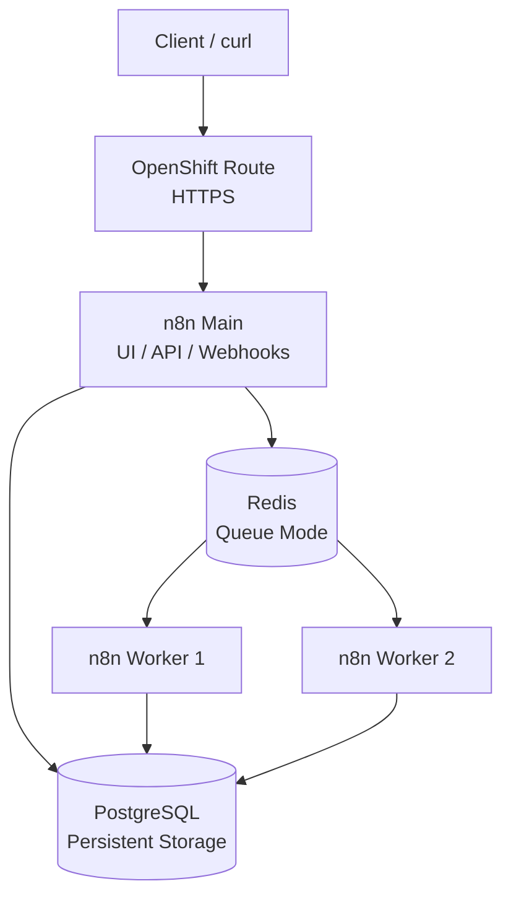
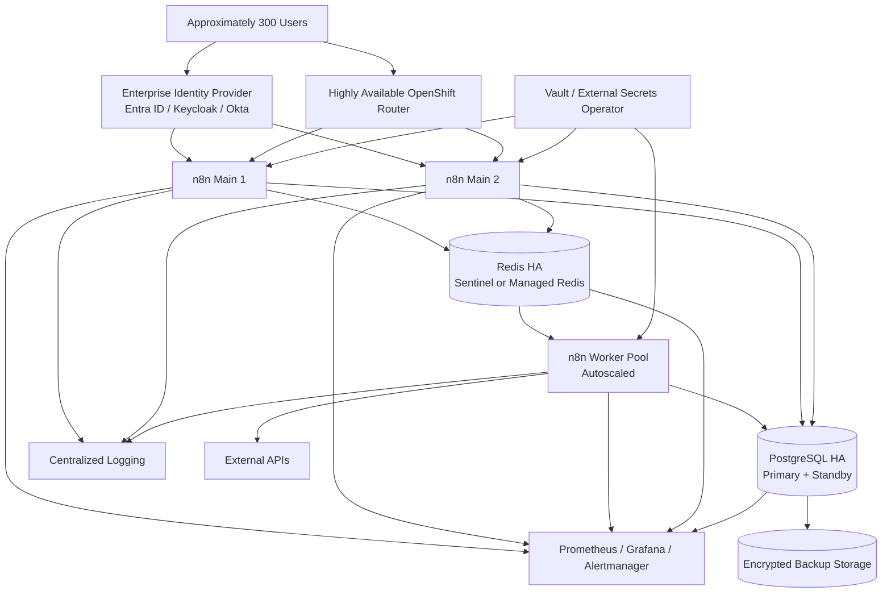

# Distributed_n8n_Platform_on_Openshift

A distributed n8n platform running on OpenShift/Kubernetes using:

- n8n Main
- Two n8n Workers
- Redis as the execution queue
- PostgreSQL as the n8n database
- OpenShift Route for external access
- Kubernetes Secrets for sensitive configuration
---
## 1. Prerequisites

For design and implement a distributed n8n platform running on Openshift , there are some requirement to deploy n8n service :
A ) an Openshift/kubernetes Cluster <br>
B ) a Container Registery with Redis,Postgresql,n8n Images <br>
C ) Persistance Storage for Postgresql and Redis pods <br> 

## 2. Deployment steps
The following steps describe how to deploy the distributed n8n platform on OpenShift.

The deployment consists of:

PostgreSQL <br>
Redis <br>
n8n Main <br>
Two n8n Workers <br>
OpenShift Route <br>
The deployment uses n8n Queue Mode, where n8n Main places workflow executions into Redis and the Workers consume and execute those jobs. <br>

## 3. Architecture

The goal of this project is to demonstrate a distributed n8n architecture using Queue Mode.

The implemented request flow is:

```text
Client
  |
  v
OpenShift Route
  |
  v
n8n Main
  |
  | enqueue execution
  v
Redis Queue
  |
  +------------------+
  |                  |
  v                  v
n8n Worker 1     n8n Worker 2
  |
  v
Workflow Execution
  |
  v
PostgreSQL
```

The n8n Main instance is responsible for:

- Web UI
- API
- Webhook handling
- Workflow management
- Creating workflow executions
- Enqueuing executions into Redis

The n8n Workers are responsible for:

- Consuming jobs from Redis
- Executing workflows
- Persisting execution state in PostgreSQL

Redis is not deployed as an unused infrastructure component. It is used as the actual asynchronous execution queue for n8n Queue Mode.

---

## 2. Implemented Architecture

### 2.1 Components

| Component | Replicas | Responsibility |
|---|---:|---|
| n8n Main | 1 | UI, API, webhook handling and queue producer |
| n8n Worker | 2 | Queue consumers and workflow execution |
| Redis | 1 | n8n execution queue |
| PostgreSQL | 1 | n8n database and execution metadata |
| OpenShift Route | 1 | External HTTPS access to n8n Main |

### 2.2 Architecture Diagram



### 2.3 Current External URL

The n8n UI is available at:

```text
https://n8n-n8n.apps.ocp.nextsysadmin.local/
```

The same hostname is used for production webhooks.

---

## 3. Repository Structure

The expected repository structure is:

```text
.
├── README.md
├── workflow.json
├── kubernetes/
│   ├── namespace.yaml
│   ├── secrets.example.yaml
│   ├── configmap.yaml
│   ├── postgres.yaml
│   ├── redis.yaml
│   ├── n8n-main.yaml
│   ├── n8n-worker.yaml
│   ├── services.yaml
│   └── route.yaml
└── docs/
    ├── architecture.md
    ├── enterprise-design.md
    ├── security.md
    ├── troubleshooting.md
    ├── observability.md
    └── disaster-recovery.md
```

Secret values must not be committed to Git.

Only an example file containing placeholder values should be committed:

```text
kubernetes/secrets.example.yaml
```

---

## 4. Prerequisites

The following tools are required:

- OpenShift cluster access
- `oc` CLI
- Kubernetes permissions to create:
  - Deployments
  - Services
  - Routes
  - ConfigMaps
  - Secrets
  - PersistentVolumeClaims
- Access to an image registry or the public n8n image
- A PostgreSQL PersistentVolume
- A Redis deployment or Redis manifest
- A configured OpenShift project/namespace

Verify cluster access:

```bash
oc whoami
oc cluster-info
oc get nodes
```

Set the target project:

```bash
export NS=<namespace>
oc project $NS
```

Example:

```bash
export NS=n8n
oc project n8n
```

---

## 5. Deployment

### 5.1 Create or Select the OpenShift Project

```bash
oc new-project $NS
```

If the project already exists:

```bash
oc project $NS
```

### 5.2 Create Secrets

Sensitive values should be stored in Kubernetes/OpenShift Secrets.

Example:

```bash
oc create secret generic n8n-secrets \
  -n $NS \
  --from-literal=DB_POSTGRESDB_USER='<postgres-user>' \
  --from-literal=DB_POSTGRESDB_PASSWORD='<postgres-password>' \
  --from-literal=DB_POSTGRESDB_DATABASE='n8n' \
  --from-literal=N8N_ENCRYPTION_KEY='<strong-encryption-key>'
```

If Redis requires authentication, add the Redis password:

```bash
oc create secret generic n8n-secrets \
  -n $NS \
  --from-literal=QUEUE_BULL_REDIS_PASSWORD='<redis-password>' \
  --dry-run=client -o yaml | oc apply -f -
```

Do not commit the real Secret manifest to Git.

Check the created Secret without printing its values:

```bash
oc get secret n8n-secrets -n $NS
```

### 5.3 Apply Kubernetes/OpenShift Resources

Apply resources in the following order:

```bash
oc apply -f kubernetes/namespace.yaml
oc apply -f kubernetes/secrets.example.yaml
oc apply -f kubernetes/configmap.yaml
oc apply -f kubernetes/postgres.yaml
oc apply -f kubernetes/redis.yaml
oc apply -f kubernetes/services.yaml
oc apply -f kubernetes/n8n-main.yaml
oc apply -f kubernetes/n8n-worker.yaml
oc apply -f kubernetes/route.yaml
```

If the namespace is already selected, manifests can also be applied using:

```bash
oc apply -f kubernetes/
```

The actual Secret containing credentials should be created separately and should not be replaced by the example Secret.

---

## 6. OpenShift Route

OpenShift uses a `Route` to expose the n8n Main Service externally.

Example Route:

```yaml
apiVersion: route.openshift.io/v1
kind: Route
metadata:
  name: n8n
  namespace: n8n
spec:
  host: n8n-n8n.apps.ocp.nextsysadmin.local
  to:
    kind: Service
    name: n8n-main
    weight: 100
  port:
    targetPort: http
  tls:
    termination: edge
    insecureEdgeTerminationPolicy: Redirect
```

The Service name and target port must match the actual n8n Main Service:

```bash
oc get svc -n $NS
oc get route -n $NS
```

Verify the Route:

```bash
oc describe route n8n -n $NS
```

Current UI URL:

```text
https://n8n-n8n.apps.ocp.nextsysadmin.local/
```

The Route forwards external HTTPS traffic to the n8n Main Service. TLS termination is performed at the OpenShift Router.

---

## 7. Verify Deployment

Check all resources:

```bash
oc get all -n $NS
```

Check Pods:

```bash
oc get pods -n $NS -o wide
```

Expected result:

```text
n8n-main-xxxxxxxxxx-xxxxx       1/1   Running
n8n-worker-xxxxxxxxxx-xxxxx     1/1   Running
n8n-worker-xxxxxxxxxx-yyyyy     1/1   Running
redis-xxxxxxxxxx-xxxxx          1/1   Running
postgres-0                      1/1   Running
```

Check Deployments:

```bash
oc get deployments -n $NS
```

Expected minimum deployment:

```text
n8n-main       1 replica
n8n-worker     2 replicas
```

Check Worker replicas:

```bash
oc get deployment n8n-worker \
  -n $NS \
  -o jsonpath='{.spec.replicas}{"\n"}'
```

Expected output:

```text
2
```

Check rollout status:

```bash
oc rollout status deployment/n8n-main -n $NS
oc rollout status deployment/n8n-worker -n $NS
```

---

## 8. n8n Queue Mode Configuration

The Main and Worker deployments use the same shared configuration.

Important configuration includes:

```text
EXECUTIONS_MODE=queue
DB_TYPE=postgresdb
DB_POSTGRESDB_HOST=<postgres-service>
DB_POSTGRESDB_PORT=5432
DB_POSTGRESDB_DATABASE=n8n
QUEUE_BULL_REDIS_HOST=<redis-service>
QUEUE_BULL_REDIS_PORT=6379
N8N_ENCRYPTION_KEY=<shared-secret>
```

The `N8N_ENCRYPTION_KEY` must be exactly the same on:

- n8n Main
- Worker 1
- Worker 2

The encryption key is required so that Main and Workers can correctly access encrypted n8n credentials and data.

Verify non-sensitive environment variables:

```bash
oc exec deployment/n8n-main -n $NS -- \
  env | sort | grep -E 'EXECUTIONS_MODE|QUEUE|REDIS|DB_|EXECUTIONS'
```

Verify Worker configuration:

```bash
oc exec deployment/n8n-worker -n $NS -- \
  env | sort | grep -E 'EXECUTIONS_MODE|QUEUE|REDIS|DB_|EXECUTIONS'
```

The encryption key itself must not be printed in documentation or logs.

For comparison, a hash can be generated without exposing the key:

```bash
oc exec deployment/n8n-main -n $NS -- \
  sh -c 'printf "%s" "$N8N_ENCRYPTION_KEY" | sha256sum'
```

Run the same command against a Worker Pod and compare the hashes.

---

## 9. How Queue Mode Works

In Queue Mode, the n8n Main instance does not act as the primary workflow execution process.

The execution flow is:

```text
1. Client sends an HTTP request
2. OpenShift Route forwards the request to n8n Main
3. n8n Main receives the webhook
4. n8n Main creates an execution job
5. The job is placed into Redis
6. An available Worker consumes the job
7. The Worker executes the workflow
8. Execution state is stored in PostgreSQL
9. The response is returned to the client
```

Redis is used as the producer/consumer queue:

```text
n8n Main  --->  Redis Queue  <---  n8n Workers
```

This design separates request handling from workflow execution and allows the Worker layer to scale independently.

---

## 10. Simple Verification Workflow

The repository contains a simple workflow in:

```text
workflow.json
```

The workflow is intentionally simple and contains:

```text
Webhook
  |
  v
Receive JSON
  |
  v
Simple Processing
  |
  v
Return Response
```

The workflow accepts input similar to:

```json
{
  "message": "hello",
  "request_id": "12345"
}
```

The expected response is:

```json
{
  "message": "hello",
  "request_id": "12345",
  "processed": true
}
```

The workflow does not include complex business logic or external integrations. Its purpose is to verify the distributed n8n execution architecture.

---

## 11. Accessing n8n

Open the following URL in a browser:

```text
https://n8n-n8n.apps.ocp.nextsysadmin.local/
```

After logging in:

1. Import `workflow.json`
2. Confirm that the Webhook node is configured
3. Save the workflow
4. Activate the workflow
5. Use the production webhook URL for testing

Important:

- `/webhook-test/` is intended for temporary test executions while the workflow is listening in test mode.
- `/webhook/` is the production webhook path for an activated workflow.

---

## 12. Webhook Test

The example webhook endpoint is:

```text
https://n8n-n8n.apps.ocp.nextsysadmin.local/webhook/distributed-test
```

The exact path depends on the path configured in the Webhook node. If a different path is configured, replace `distributed-test` accordingly.

Send a request:

```bash
curl -k -i -X POST \
  'https://n8n-n8n.apps.ocp.nextsysadmin.local/webhook/distributed-test' \
  -H 'Content-Type: application/json' \
  -d '{
    "message": "hello",
    "request_id": "final-worker-test-001"
  }'
```

Expected response:

```json
{
  "message": "hello",
  "request_id": "final-worker-test-001",
  "processed": true
}
```

The `-k` option is only required when the OpenShift cluster uses a certificate that is not trusted by the local machine.

In a production environment, the cluster CA or a trusted public certificate should be installed instead of using `-k`.

---

## 13. Verifying Worker Execution

The execution must be verified using both n8n execution information and Worker logs.

### 13.1 Watch Worker Logs

List Worker Pods:

```bash
oc get pods -n $NS -l app=n8n-worker -o wide
```

Follow logs from all Worker Pods:

```bash
oc logs -n $NS \
  -l app=n8n-worker \
  --prefix=true \
  --timestamps=true \
  -f
```

If the label is different, list the Pods and use their names directly:

```bash
oc get pods -n $NS
oc logs -n $NS <worker-pod-name> -f --timestamps=true
```

### 13.2 Send a Request with a Unique Request ID

```bash
curl -k -i -X POST \
  'https://n8n-n8n.apps.ocp.nextsysadmin.local/webhook/distributed-test' \
  -H 'Content-Type: application/json' \
  -d '{
    "message": "hello",
    "request_id": "worker-proof-001"
  }'
```

### 13.3 Save Recent Worker Logs

```bash
oc logs -n $NS \
  -l app=n8n-worker \
  --prefix=true \
  --timestamps=true \
  --since=10m > worker-execution-proof.log
```

Search the logs:

```bash
grep -iE \
  'worker-proof-001|execution|job|processed|success' \
  worker-execution-proof.log
```

The exact log format depends on the n8n version and logging configuration.

The strongest verification is correlating:

1. The webhook request timestamp or request ID
2. The execution record in the n8n UI
3. The corresponding Worker Pod log
4. The Execution ID, where available

The expected execution path is:

```text
HTTP Request
  |
  v
OpenShift Route
  |
  v
n8n Main
  |
  v
Redis Queue
  |
  v
n8n Worker
  |
  v
Workflow Execution
```

A field such as `"processed": true` alone does not prove that a Worker executed the workflow. Worker logs and execution information are used as the evidence.

---

## 14. Scaling Workers

The Worker Deployment is independently scalable from n8n Main.

Current state:

```bash
oc get deployment n8n-worker -n $NS
```

Scale from two to three Workers:

```bash
oc scale deployment/n8n-worker \
  -n $NS \
  --replicas=3
```

Wait for the rollout:

```bash
oc rollout status deployment/n8n-worker -n $NS
```

Verify the Pods:

```bash
oc get pods -n $NS -l app=n8n-worker -o wide
```

Scale back to two Workers:

```bash
oc scale deployment/n8n-worker \
  -n $NS \
  --replicas=2
```

In a larger environment, the same mechanism can be used to scale to five or ten Workers:

```bash
oc scale deployment/n8n-worker \
  -n $NS \
  --replicas=10
```

Workers increase execution capacity without scaling the UI/API component. The practical limit depends on:

- CPU and memory available in the cluster
- Workflow execution duration
- Redis capacity
- PostgreSQL capacity
- External API rate limits
- Worker concurrency
- The number of simultaneous executions

---

## 15. Resource Requests, Limits and Probes

The Deployments should define resource requests and limits.

Example:

```yaml
resources:
  requests:
    cpu: 100m
    memory: 256Mi
  limits:
    cpu: "1"
    memory: 1Gi
```

These values are starting points and should be tuned using actual metrics.

Inspect the deployed resources:

```bash
oc get deployment n8n-main -n $NS -o yaml
oc get deployment n8n-worker -n $NS -o yaml
```

Inspect Pod events and probes:

```bash
oc describe pod -n $NS <main-pod-name>
oc describe pod -n $NS <worker-pod-name>
```

The deployment should include:

- Readiness probe
- Liveness probe
- Resource requests
- Resource limits
- Restart behavior through the Deployment controller

Readiness probes prevent traffic from being sent to an unavailable Main Pod.

Liveness probes allow OpenShift/Kubernetes to restart a stuck container.

---

## 16. PostgreSQL

PostgreSQL is used as the n8n database.

It stores:

- Workflow definitions
- Credentials metadata
- Execution metadata
- User and configuration data
- n8n application state

Check PostgreSQL resources:

```bash
oc get pod -n $NS
oc get svc -n $NS
oc get pvc -n $NS
```

Check PersistentVolumeClaims:

```bash
oc describe pvc -n $NS
```

Both n8n Main and n8n Workers must connect to the same PostgreSQL instance/service.

The challenge implementation uses one PostgreSQL instance. This is sufficient for the technical challenge but is a single point of failure for production.

---

## 17. Redis

Redis is used as the n8n Queue Mode backend.

Redis responsibilities:

- Store pending execution jobs
- Allow Main to enqueue jobs
- Allow Workers to consume jobs
- Coordinate asynchronous execution

Redis is connected to both Main and Workers.

Check Redis:

```bash
oc get pods -n $NS
oc get svc -n $NS
oc logs -n $NS <redis-pod-name>
```

If Redis becomes unavailable:

- New queue-based executions may fail or remain unavailable
- Main may not be able to enqueue new jobs
- Workers may lose connectivity to the queue
- Existing executions can be affected depending on their current state
- Recovery requires restoring Redis connectivity and validating pending jobs

Redis is deployed as a single instance for this challenge. Redis HA, persistence tuning, Sentinel or Redis Cluster are not implemented here.

---

## 18. Configuration and Secrets

Credentials are not hardcoded in:

- Git
- Container images
- Workflow code
- Plain Kubernetes manifests

Sensitive configuration is stored in OpenShift Secrets, including:

- PostgreSQL username
- PostgreSQL password
- n8n encryption key
- Redis password, if enabled

The encryption key is especially important. It must be shared by Main and all Workers.

Example Secret structure:

```yaml
apiVersion: v1
kind: Secret
metadata:
  name: n8n-secrets
type: Opaque
stringData:
  DB_POSTGRESDB_USER: change-me
  DB_POSTGRESDB_PASSWORD: change-me
  DB_POSTGRESDB_DATABASE: n8n
  N8N_ENCRYPTION_KEY: change-me
```

This file is an example only. Real credentials must be provisioned outside Git.

For enterprise environments, the recommended approach is:

- External Secrets Operator
- HashiCorp Vault
- OpenShift Secret Store integration
- Cloud Secret Manager
- Automatic secret rotation
- Audited access to secrets

---

## 19. Known Limitations

This implementation is intentionally focused on the technical challenge and has the following limitations:

1. PostgreSQL is deployed as a single instance.
2. Redis is deployed as a single instance.
3. There is one n8n Main replica.
4. No production-grade Redis HA is implemented.
5. No production-grade PostgreSQL HA is implemented.
6. Full SSO/OIDC integration is not implemented.
7. No complete monitoring stack is included.
8. No autoscaling based on queue depth is implemented.
9. No complete CI/CD pipeline is implemented.
10. No cross-region disaster recovery is implemented.
11. The OpenShift Route and platform certificate depend on the cluster configuration.
12. The simple workflow does not represent a complex business workflow.
13. Persistent storage, backup and restore policies require production hardening.
14. Queue and execution metrics require additional observability integration.

These limitations are addressed in the enterprise proposal below.

---

# Enterprise Architecture Proposal

## 20. Enterprise Target

The target organization has approximately 300 users across multiple technical and business teams.

The production platform should support:

- Multiple departments
- Multiple workflows
- Business-critical automations
- Secure credentials
- Team isolation
- High availability
- Horizontal scaling
- Monitoring and alerting
- Backup and disaster recovery
- Centralized authentication

---

## 21. Enterprise Architecture Diagram



---

## 22. High Availability

### Current Single Points of Failure

The current challenge implementation has these single points of failure:

- One n8n Main replica
- One Redis instance
- One PostgreSQL instance
- One storage instance or volume
- Potentially one OpenShift Route endpoint, depending on cluster design

### Production Improvements

#### n8n Main

Run multiple Main replicas behind the OpenShift Service and Route:

```text
n8n Main x2 or more
```

Main replicas should share:

- PostgreSQL
- Redis
- Encryption key
- Configuration
- External authentication provider

#### n8n Workers

Run multiple Worker replicas across different nodes or availability zones:

```text
n8n Worker xN
```

Use topology spread constraints or pod anti-affinity to avoid placing all Workers on the same node.

#### Redis

Use one of:

- Managed Redis
- Redis Sentinel
- Redis Cluster
- A platform-supported HA Redis service

Redis should have:

- Persistent storage where appropriate
- Authentication
- TLS
- Monitoring
- Memory policies
- Failure detection
- Tested recovery procedures

#### PostgreSQL

Use:

- PostgreSQL HA operator
- Primary and standby replicas
- Synchronous or asynchronous replication
- Automated failover
- Connection pooling
- Encrypted backups
- Point-in-time recovery

#### OpenShift

Use:

- Multiple control-plane and worker nodes
- Redundant routers
- Multiple availability zones where possible
- Pod anti-affinity
- PodDisruptionBudgets
- Resource quotas
- NetworkPolicies

---

## 23. Scalability

Workers are the main execution-capacity scaling unit.

Scale Workers based on:

- Queue depth
- Processing latency
- CPU utilization
- Memory utilization
- Active executions
- Failed jobs
- Workflow duration

Example:

```bash
oc scale deployment/n8n-worker \
  -n $NS \
  --replicas=10
```

In production, Horizontal Pod Autoscaling or a custom autoscaler could use:

- CPU and memory metrics
- Redis queue depth
- Execution latency
- Number of pending jobs

Potential bottlenecks include:

1. Worker CPU or memory
2. Worker concurrency
3. Redis memory or connections
4. PostgreSQL CPU, connections or query latency
5. Persistent storage I/O
6. External API latency and rate limits
7. OpenShift node capacity

Queue growth should be interpreted together with Worker capacity and workflow duration. Adding Workers does not solve a bottleneck in PostgreSQL or an external API.

---

## 24. Authentication

For approximately 300 users, n8n should integrate with an enterprise Identity Provider using OIDC or SAML.

Possible providers:

- Microsoft Entra ID
- Keycloak
- Okta
- Authentik

Recommended approach:

1. Integrate n8n with the corporate Identity Provider.
2. Enforce MFA at the Identity Provider.
3. Use group-based access.
4. Automate user lifecycle management.
5. Disable or restrict local accounts where possible.
6. Audit login and administrative events.
7. Apply session timeout and access policies.

Microsoft Entra ID is a practical choice for organizations already using Microsoft 365. Keycloak is suitable when an independently managed open-source Identity Provider is preferred.

---

## 25. Authorization and Team Isolation

Teams should not have unrestricted access to one another's workflows and credentials.

Recommended design:

- Create separate n8n projects or teams for departments.
- Map Identity Provider groups to n8n teams.
- Give each team only the minimum required permissions.
- Restrict credential creation and sharing.
- Separate administrative users from workflow developers.
- Use dedicated service accounts for integrations.
- Audit credential and workflow access.

Example logical separation:

```text
Finance
  - Finance workflows
  - Finance credentials
  - Finance users

DevOps
  - DevOps workflows
  - DevOps credentials
  - DevOps users
```

n8n access-control capabilities and edition-specific limitations should be evaluated before production. Where strict isolation is required, separate n8n instances or namespaces may be more appropriate than relying only on logical project separation.

---

## 26. Security Risks and Controls

| Risk | Proposed Control |
|---|---|
| Credential exposure | Kubernetes Secrets, External Secrets Operator or Vault |
| Unauthorized workflow access | SSO, RBAC, least privilege and team isolation |
| Public webhook abuse | Authentication, signature validation, rate limiting and WAF |
| Sensitive data in logs | Redaction, structured logging and restricted log access |
| Excessive network access | Kubernetes NetworkPolicies and egress restrictions |
| Untrusted workflow execution | Controlled user access, code review and sandboxing |
| Weak encryption key | Strong randomly generated key stored in a secret manager |
| Vulnerable container image | Image scanning and regular patching |
| Route exposure | TLS, secure headers and controlled network access |
| Data loss | PostgreSQL backups and tested restore procedures |
| DoS through executions | Quotas, rate limits and execution policies |
| Secret sprawl | Centralized secret management and rotation |

---

## 27. Failure Handling

### 27.1 Redis Failure

Expected behavior:

- Main cannot reliably enqueue new executions.
- New webhook-triggered executions may fail or become unavailable.
- Workers cannot consume new jobs.
- Pending executions may remain unavailable until Redis is recovered.
- Existing in-progress workflow behavior depends on the execution state and n8n version.

Recovery steps:

1. Verify Redis Pod and Service.
2. Check Redis logs.
3. Check DNS and network connectivity from Main and Workers.
4. Check Redis memory and connection limits.
5. Restore Redis or fail over to the HA instance.
6. Validate queue health.
7. Send a controlled webhook test.
8. Check execution status and Worker logs.

Production improvement:

- Managed Redis or Redis HA
- Authentication and TLS
- Persistent configuration where required
- Monitoring and alerting
- Tested failover procedure

### 27.2 Worker Failure

If one Worker fails:

- The other Worker can continue processing jobs.
- Kubernetes marks the failed Pod as unhealthy.
- The Deployment controller recreates the Pod.
- Pending jobs remain in Redis and can be consumed by an available Worker.
- An execution interrupted during processing may require retry or recovery depending on its state.

Troubleshooting:

```bash
oc get pods -n $NS -l app=n8n-worker
oc describe pod -n $NS <worker-pod-name>
oc logs -n $NS <worker-pod-name> --previous
oc get events -n $NS --sort-by=.lastTimestamp
```

Check:

- OOMKilled status
- CPU throttling
- Memory limits
- Redis connectivity
- PostgreSQL connectivity
- Worker concurrency
- Node health
- Image and configuration errors

### 27.3 PostgreSQL Failure

Potential impact:

- Main may not be able to load workflows or create executions.
- Workers may not be able to persist execution state.
- New executions can fail.
- Existing executions may fail or remain incomplete.
- User access to the UI may be degraded.

Production recovery should include:

- PostgreSQL HA
- Automated failover
- Point-in-time recovery
- Connection pooling
- Regular restore tests
- Monitoring storage and query latency

### 27.4 External API Failure

For workflows that call external APIs:

- Configure connection and request timeouts.
- Use bounded retries.
- Apply exponential backoff.
- Use rate limiting.
- Handle 5xx responses explicitly.
- Avoid retrying non-retryable 4xx errors.
- Use dead-letter or error workflows where appropriate.
- Prevent one failing dependency from exhausting all Workers.

---

## 28. Observability Proposal

A production monitoring solution should collect metrics for the following areas.

### n8n

- Workflow execution count
- Failed executions
- Execution duration
- Active executions
- Error workflow count
- Webhook response latency

### Queue

- Queue depth
- Processing latency
- Waiting jobs
- Failed jobs
- Stalled jobs
- Retry count

### Workers

- Available Worker replicas
- CPU usage
- Memory usage
- Restart count
- Execution capacity
- Worker processing latency

### Redis

- Availability
- Memory usage
- Connected clients
- Command latency
- Queue-related metrics
- Evictions and rejected connections

### PostgreSQL

- Availability
- CPU usage
- Memory usage
- Active connections
- Query latency
- Lock activity
- Storage utilization
- Replication lag in HA mode

### Kubernetes/OpenShift

- Pod readiness
- Pod restarts
- OOMKilled events
- Deployment availability
- PVC capacity
- Node pressure
- Route errors and HTTP 5xx responses

### Logging

Logs should include:

- Timestamp
- Component name
- Pod name
- Execution ID where available
- Request correlation ID
- Error type
- Retry information
- Duration

Logs must not include:

- Passwords
- API tokens
- Encryption keys
- OAuth client secrets
- Sensitive business payloads
- Personal data unless strictly required

### Recommended Alerts

- High workflow failure rate
- Queue continuously growing
- Worker replica unavailable
- Redis unavailable
- PostgreSQL unavailable
- High execution latency
- High restart count
- PVC nearly full
- High memory usage
- HTTP 502/503 rate above threshold

---

## 29. Backup and Disaster Recovery

### Suggested Production Targets

| Item | Target |
|---|---|
| RPO | 15 minutes or less for business-critical data |
| RTO | 1 hour or less |
| PostgreSQL backup | Daily full backup plus continuous WAL/PITR |
| Backup retention | 30 to 90 days |
| Backup location | Separate encrypted object storage |
| Restore testing | At least quarterly |

### Data to Back Up

- PostgreSQL database
- n8n workflows
- n8n users and configuration
- Credentials metadata
- Kubernetes manifests
- ConfigMaps
- Secret references
- External secret configuration
- Route and Service configuration

Actual secret values should be backed up through the approved secret-management system, not committed to Git.

### Restore Strategy

1. Provision a clean OpenShift namespace.
2. Restore PostgreSQL.
3. Restore or recreate Redis.
4. Restore Secrets using the secret-management solution.
5. Deploy n8n Main and Workers.
6. Verify the shared encryption key.
7. Validate workflow and credential access.
8. Execute a controlled webhook test.
9. Confirm Worker execution and database persistence.

Restore procedures must be tested regularly.

---

## 30. CI/CD Proposal

Recommended environment flow:

```text
Development
    |
    v
Staging
    |
    v
Production
```

### Kubernetes Configuration

- Store manifests in Git.
- Use Kustomize overlays or Helm values per environment.
- Review changes through pull requests.
- Use GitOps with Argo CD or OpenShift GitOps where possible.
- Separate environment configuration from application code.

### n8n Workflows

- Export workflows to version-controlled JSON.
- Review workflow changes.
- Avoid storing secrets inside workflow JSON.
- Promote workflows from Development to Staging and Production.
- Use controlled import/deployment procedures.

### Secrets

- Do not store real secrets in Git.
- Use Vault, External Secrets Operator or a cloud secret manager.
- Rotate secrets regularly.
- Limit access by namespace and service account.

### Deployment and Rollback

- Deploy immutable image versions.
- Use rolling updates.
- Verify readiness and smoke tests.
- Keep previous image and manifest versions.
- Roll back using Git or:

```bash
oc rollout undo deployment/n8n-main -n $NS
oc rollout undo deployment/n8n-worker -n $NS
```

---

## 31. Troubleshooting Scenarios

### Scenario A: Queue Growth

Symptoms:

```text
Queue depth: 100 -> 500 -> 2,000 -> 10,000
```

Investigation steps:

1. Check Worker availability:

```bash
oc get pods -n $NS -l app=n8n-worker
oc get deployment n8n-worker -n $NS
```

2. Check Worker logs:

```bash
oc logs -n $NS \
  -l app=n8n-worker \
  --prefix=true \
  --since=15m
```

3. Check CPU and memory:

```bash
oc adm top pods -n $NS
```

4. Check Worker restarts and OOMKilled events:

```bash
oc get pods -n $NS
oc describe pod -n $NS <worker-pod-name>
```

5. Check Redis health and resource usage.
6. Check PostgreSQL connectivity and latency.
7. Check workflow execution duration.
8. Check external API response timeouts and rate limits.
9. Increase Worker replicas if Workers are the bottleneck.
10. Review concurrency and resource limits.

Scaling example:

```bash
oc scale deployment/n8n-worker \
  -n $NS \
  --replicas=5
```

A continuously growing queue indicates that incoming work is arriving faster than the platform can process it. Adding Workers is appropriate only when Redis, PostgreSQL and external dependencies can support the additional load.

### Scenario B: Worker Failure

Symptoms:

```text
Worker 1 DOWN
Worker 2 RUNNING
```

Expected behavior:

- Worker 2 continues processing jobs.
- Kubernetes restarts Worker 1.
- Pending jobs remain available for processing.
- Capacity is temporarily reduced.

Investigation commands:

```bash
oc get pods -n $NS -l app=n8n-worker -o wide
oc describe pod -n $NS <failed-worker-pod-name>
oc logs -n $NS <failed-worker-pod-name> --previous
oc get events -n $NS --sort-by=.lastTimestamp
```

Investigate:

- Container exit code
- OOMKilled status
- Redis connectivity
- PostgreSQL connectivity
- CPU and memory limits
- Node conditions
- Image pull failures
- Configuration and Secret references
- Probe failures

After recovery:

```bash
oc rollout status deployment/n8n-worker -n $NS
oc get pods -n $NS -l app=n8n-worker
```

Send a controlled test request and correlate the execution with Worker logs.

### Scenario C: HTTP 502

For an HTTP 502, inspect the complete path:

```text
Client
  |
  v
OpenShift Route
  |
  v
Service
  |
  v
n8n Main
```

Commands:

```bash
oc get route -n $NS
oc describe route n8n -n $NS
oc get svc -n $NS
oc get endpoints -n $NS
oc get pods -n $NS -o wide
oc logs -n $NS deployment/n8n-main --since=15m
```

Check:

- Route target Service name
- Service target port
- Service selector
- Endpoint availability
- Main Pod readiness
- TLS termination
- Network policies
- Application listening port
- Recent deployment or configuration changes

---

## 32. Important Technical Decisions

### Queue Mode

**Decision:** Use n8n Queue Mode.

**Reason:**  
Queue Mode separates HTTP/API handling from workflow execution and allows executions to be distributed across multiple Workers.

**Alternative:**  
Run a single n8n instance in regular execution mode.

**Trade-off:**  
Queue Mode requires Redis and shared configuration, but provides better scalability and separation of responsibilities.

### Redis

**Decision:**  
Use Redis as the actual n8n execution queue.

**Reason:**  
n8n uses Redis to enqueue and distribute execution jobs between Main and Workers.

**Alternative:**  
Use a single in-process n8n instance.

**Trade-off:**  
Redis introduces an additional dependency and operational responsibility, but is required for distributed Queue Mode.

### Worker Separation

**Decision:**  
Deploy Workers as a separate Deployment with two replicas.

**Reason:**  
Workers can be scaled independently without scaling the UI/API layer.

**Alternative:**  
Run execution processes inside the Main Pod.

**Trade-off:**  
Separate Workers require shared database, Redis and encryption configuration.

### OpenShift/Kubernetes

**Decision:**  
Use Deployments, Services, Secrets, PVCs and an OpenShift Route.

**Reason:**  
Kubernetes provides declarative deployment, restart behavior, service discovery and horizontal scaling.

**Alternative:**  
Run n8n directly on virtual machines.

**Trade-off:**  
Kubernetes adds platform complexity but improves repeatability and operations.

### PostgreSQL

**Decision:**  
Use PostgreSQL as the shared n8n database.

**Reason:**  
PostgreSQL is suitable for persistent workflow, user and execution metadata.

**Alternative:**  
Use SQLite for a single-node test environment.

**Trade-off:**  
PostgreSQL requires persistent storage and database operations but is appropriate for a distributed n8n deployment.

### Scaling

**Decision:**  
Scale the Worker Deployment horizontally.

**Reason:**  
Workflow execution is the main capacity dimension and Workers consume jobs independently.

**Trade-off:**  
Additional Workers increase load on Redis, PostgreSQL and external dependencies.

---

## 33. Final Validation Checklist

### Kubernetes/OpenShift

- [ ] Namespace/project exists
- [ ] n8n Main Deployment is running
- [ ] n8n Worker Deployment has two replicas
- [ ] Redis is running
- [ ] PostgreSQL is running
- [ ] PostgreSQL uses PersistentVolumeClaim
- [ ] Services are available
- [ ] OpenShift Route is configured
- [ ] Resource requests and limits are configured
- [ ] Readiness probes are configured
- [ ] Liveness probes are configured

### n8n

- [ ] Queue Mode is enabled
- [ ] Main uses PostgreSQL
- [ ] Workers use PostgreSQL
- [ ] Main uses Redis
- [ ] Workers use Redis
- [ ] Main and Workers use the same encryption key
- [ ] Workflow is imported
- [ ] Workflow is activated
- [ ] Production webhook works

### Verification

- [ ] Webhook request returns the expected response
- [ ] Execution is visible in n8n
- [ ] Worker logs show execution activity
- [ ] Execution ID or timestamp is correlated with Worker logs
- [ ] Worker scaling from two to three replicas works
- [ ] Worker scaling back to two replicas works

### Documentation

- [ ] Architecture documented
- [ ] Queue Mode documented
- [ ] Worker scaling documented
- [ ] Failure handling documented
- [ ] Security proposal documented
- [ ] Enterprise architecture documented
- [ ] Backup and DR proposal documented
- [ ] Observability proposal documented
- [ ] Troubleshooting scenarios documented
- [ ] No real credentials committed to Git

---

## 34. Summary

This implementation demonstrates a distributed n8n platform running on OpenShift:

```text
Client
  |
  v
OpenShift Route
  |
  v
n8n Main
  |
  v
Redis Queue
  |
  +----------------+
  |                |
  v                v
Worker 1        Worker 2
  |
  v
PostgreSQL
```

The platform uses n8n Queue Mode, Redis as the asynchronous execution queue, PostgreSQL as the shared database and two independent Worker replicas.

The current implementation is intentionally simple and suitable for the challenge. Before production use for approximately 300 users, the platform should be enhanced with:

- Highly available PostgreSQL
- Highly available Redis
- Multiple n8n Main replicas
- Enterprise SSO and MFA
- Stronger team isolation
- Centralized secret management
- Monitoring and alerting
- Backup and disaster recovery
- GitOps-based CI/CD
- Network policies and rate limiting
- Capacity planning and autoscaling
```

