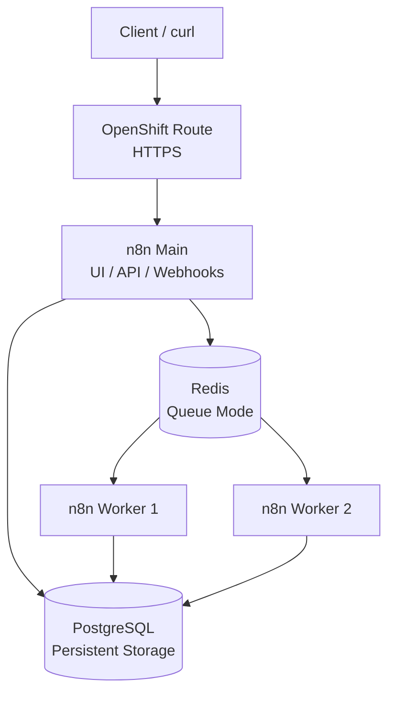

# Distributed_n8n_Platform_on_Openshift

A distributed n8n platform running on OpenShift/Kubernetes using:

- n8n Main
- Two n8n Workers
- Redis as the execution queue
- PostgreSQL as the n8n database
- OpenShift Route for external access
- Kubernetes Secrets for sensitive configuration
---
## 1. Prerequisites

For design and implement a distributed n8n platform running on Openshift , there are some requirement to deploy n8n service : <br>
A ) an Openshift/kubernetes Cluster <br>
B ) a Container Registery with Redis,Postgresql,n8n Images <br>
C ) Persistance Storage for Postgresql and Redis pods <br> 

## 2. Deployment steps
The following steps describe how to deploy the distributed n8n platform on OpenShift.

The deployment consists of:

PostgreSQL <br>
Redis <br>
n8n Main <br>
Two n8n Workers <br>
OpenShift Route <br>
The deployment uses n8n Queue Mode, where n8n Main places workflow executions into Redis and the Workers consume and execute those jobs. <br>

## 3. Architecture

The goal of this project is to demonstrate a distributed n8n architecture using Queue Mode.

The implemented request flow is:

```text
Client
  |
  v
OpenShift Route
  |
  v
n8n Main
  |
  | enqueue execution
  v
Redis Queue
  |
  +------------------+
  |                  |
  v                  v
n8n Worker 1     n8n Worker 2
  |
  v
Workflow Execution
  |
  v
PostgreSQL
```

The n8n Main instance is responsible for:

- Web UI
- API
- Webhook handling
- Workflow management
- Creating workflow executions
- Enqueuing executions into Redis

The n8n Workers are responsible for:

- Consuming jobs from Redis
- Executing workflows
- Persisting execution state in PostgreSQL

Redis is not deployed as an unused infrastructure component. It is used as the actual asynchronous execution queue for n8n Queue Mode.

---


| Component | Replicas | Responsibility |
|---|---:|---|
| n8n Main | 1 | UI, API, webhook handling and queue producer |
| n8n Worker | 2 | Queue consumers and workflow execution |
| Redis | 1 | n8n execution queue |
| PostgreSQL | 1 | n8n database and execution metadata |
| OpenShift Route | 1 | External HTTPS access to n8n Main |

### 3.2 Architecture Diagram



### 3.3 Current External URL

The n8n UI is available at:

```text
https://n8n-n8n.apps.ocp.nextsysadmin.local/
```

The same hostname is used for production webhooks.

---


## 4. Configuration

### 4.1 Create or Select the OpenShift Project

```bash
oc new-project $NS
```

If the project already exists:

```bash
oc project $NS
```

### 4.2 Create Secrets

Sensitive values should be stored in Kubernetes/OpenShift Secrets.

Example:

```bash
oc create secret generic n8n-secrets \
  -n $NS \
  --from-literal=DB_POSTGRESDB_USER='<postgres-user>' \
  --from-literal=DB_POSTGRESDB_PASSWORD='<postgres-password>' \
  --from-literal=DB_POSTGRESDB_DATABASE='n8n' \
  --from-literal=N8N_ENCRYPTION_KEY='<strong-encryption-key>'
```

If Redis requires authentication, add the Redis password:

```bash
oc create secret generic n8n-secrets \
  -n $NS \
  --from-literal=QUEUE_BULL_REDIS_PASSWORD='<redis-password>' \
  --dry-run=client -o yaml | oc apply -f -
```

Do not commit the real Secret manifest to Git.

Check the created Secret without printing its values:

```bash
oc get secret n8n-secrets -n $NS
```

### 4.3 Apply Kubernetes/OpenShift Resources

Apply resources in the following order:

```bash
oc apply -f kubernetes/namespace.yaml
oc apply -f kubernetes/secrets.example.yaml
oc apply -f kubernetes/postgres.yaml
oc apply -f kubernetes/redis.yaml
oc apply -f kubernetes/services.yaml
oc apply -f kubernetes/n8n-main.yaml
oc apply -f kubernetes/n8n-worker.yaml
oc apply -f kubernetes/route.yaml
```
## 4.4 Output of configuration
<b>4.4.1 (namespace)</b>  <br>
 <br>
<b>4.4.2 (PVs)</b> <br>
 <br>
<b>4.4.3 (PVCs )</b> <br>
 <br>
<b>4.4.4 (Secrets )</b> <br>
 <br>
<b>4.4.5 (Deployments )</b> <br>
 <br>
<b>4.4.6 (Services )</b> <br>
 <br>
<b>4.4.7 (Route )</b> <br>
 <br>
<b>4.4.8 (Resource Qouta )</b> <br>
 <br>
<b>4.4.9 (HPA )</b> <br>
 <br>
<b>4.4.9 (Image Registry )</b> <br>
 <br>


---

## 5. How to access n8n

OpenShift uses a `Route` to expose the n8n Main Service externally.

Example Route:

```yaml
apiVersion: route.openshift.io/v1
kind: Route
metadata:
  name: n8n
  namespace: n8n
spec:
  host: n8n-n8n.apps.ocp.nextsysadmin.local
  to:
    kind: Service
    name: n8n-main
    weight: 100
  port:
    targetPort: http
  tls:
    termination: edge
    insecureEdgeTerminationPolicy: Redirect
```

Current UI URL:

```text
https://n8n-n8n.apps.ocp.nextsysadmin.local/
```

The Route forwards external HTTPS traffic to the n8n Main Service. TLS termination is performed at the OpenShift Router.

---
 <br>

## 6. How to test the webhook

- check url that n8n expose successfuly : <br>
 <br>
- setup inital config for n8n ui : <br>
 <br>
- create webhook like below : <br>
 <br>
- edit filed node like below to answer  "request_id Value: worker-test-001" : <br>
 <br>
- check execution mode on main node and worker nodes : <br>
 <br>
 <br>
- publish workflow and test webhook call  : <br>
 <br>
- check output on ui : <br>
 <br>
- check logs of worker pods in openshift : <br>
 <br>
 <br>

## 7&8. Example request and Expected response
send http request (webbook call ) and get response : <br>
 <br>
 <br>


---


## 9. How Queue Mode Works

In Queue Mode, the n8n Main instance does not act as the primary workflow execution process.

The execution flow is:

```text
1. Client sends an HTTP request
2. OpenShift Route forwards the request to n8n Main
3. n8n Main receives the webhook
4. n8n Main creates an execution job
5. The job is placed into Redis
6. An available Worker consumes the job
7. The Worker executes the workflow
8. Execution state is stored in PostgreSQL
9. The response is returned to the client
```

Redis is used as the producer/consumer queue:

```text
n8n Main  --->  Redis Queue  <---  n8n Workers
```

This design separates request handling from workflow execution and allows the Worker layer to scale independently.

---

## 10. How Workers are configured

In this example, n8n Workers should be configured using **queue mode**. The main n8n instance receives requests and adds executions to Redis. The Workers retrieve those executions from Redis and process them.

### Main n8n Instance

```yaml
apiVersion: apps/v1
kind: Deployment
metadata:
  name: n8n-main
spec:
  replicas: 1
  selector:
    matchLabels:
      app: n8n-main
  template:
    metadata:
      labels:
        app: n8n-main
    spec:
      containers:
        - name: n8n
          image: n8nio/n8n:latest
          command:
            - n8n
          args:
            - start
          env:
            - name: EXECUTIONS_MODE
              value: queue

            - name: QUEUE_BULL_REDIS_HOST
              value: redis

            - name: QUEUE_BULL_REDIS_PORT
              value: "6379"

            - name: DB_TYPE
              value: postgresdb

            - name: DB_POSTGRESDB_HOST
              value: postgresql

            - name: DB_POSTGRESDB_PORT
              value: "5432"

            - name: DB_POSTGRESDB_DATABASE
              valueFrom:
                secretKeyRef:
                  name: n8n-database-secret
                  key: database

            - name: DB_POSTGRESDB_USER
              valueFrom:
                secretKeyRef:
                  name: n8n-database-secret
                  key: username

            - name: DB_POSTGRESDB_PASSWORD
              valueFrom:
                secretKeyRef:
                  name: n8n-database-secret
                  key: password

            - name: N8N_ENCRYPTION_KEY
              valueFrom:
                secretKeyRef:
                  name: n8n-secret
                  key: encryption-key
```

### n8n Worker Deployment

Workers use the same n8n image and configuration, but they run the `worker` command instead of `start`.

```yaml
apiVersion: apps/v1
kind: Deployment
metadata:
  name: n8n-worker
spec:
  replicas: 3
  selector:
    matchLabels:
      app: n8n-worker
  template:
    metadata:
      labels:
        app: n8n-worker
    spec:
      containers:
        - name: n8n-worker
          image: n8nio/n8n:latest
          command:
            - n8n
          args:
            - worker
          env:
            - name: EXECUTIONS_MODE
              value: queue

            - name: QUEUE_BULL_REDIS_HOST
              value: redis

            - name: QUEUE_BULL_REDIS_PORT
              value: "6379"

            - name: DB_TYPE
              value: postgresdb

            - name: DB_POSTGRESDB_HOST
              value: postgresql

            - name: DB_POSTGRESDB_PORT
              value: "5432"

            - name: DB_POSTGRESDB_DATABASE
              valueFrom:
                secretKeyRef:
                  name: n8n-database-secret
                  key: database

            - name: DB_POSTGRESDB_USER
              valueFrom:
                secretKeyRef:
                  name: n8n-database-secret
                  key: username

            - name: DB_POSTGRESDB_PASSWORD
              valueFrom:
                secretKeyRef:
                  name: n8n-database-secret
                  key: password

            - name: N8N_ENCRYPTION_KEY
              valueFrom:
                secretKeyRef:
                  name: n8n-secret
                  key: encryption-key
```

### Important Configuration Notes

- `EXECUTIONS_MODE` must be set to `queue`.
- The main instance and all Workers must use the same:
  - Redis server
  - PostgreSQL database
  - `N8N_ENCRYPTION_KEY`
- The number of Workers is controlled by:

```yaml
spec:
  replicas: 3
```

- Each Worker can process multiple executions concurrently. This can be configured with:

```yaml
- name: n8n_worker_max_concurrency
  value: "10"
```

The total processing capacity in this example is approximately:

```text
3 Workers × 10 concurrent executions = 30 concurrent executions
```

Workers do not require a public route or external service because they communicate internally with Redis and PostgreSQL.

---

## 11. How to scale Workers

we used HPA to Scale worker pods based on cpu and Memory .also we can use other parameters to scale workers like number of queue . 

---


## 12. Verifying Worker Execution

we test it in step 6 .<br>

---

### 13 Known limitations

### Limitations of This Architecture

This example is suitable for development, testing, or a small production deployment, but it has several limitations.

#### 13.1 Single-node Redis

Redis is deployed as a single instance and represents a single point of failure.

If Redis becomes unavailable:

- New executions cannot be queued.
- Workers cannot retrieve queued executions.
- Queue-based workflow processing stops.
- Redis data may be lost if persistence is not enabled.

For production, Redis should be replaced with a highly available solution, such as:

- Redis Sentinel
- Redis Cluster
- A managed Redis service

Redis persistence, authentication, TLS, memory limits, and eviction policies should also be configured.

#### 13.2 Single PostgreSQL Instance

PostgreSQL is also deployed as a single instance. It stores:

- Workflow definitions
- Credentials
- Execution metadata
- User and project information
- n8n configuration data

If PostgreSQL fails, n8n may become unavailable even if Redis and the Workers are still running.

The example does not provide:

- Database replication
- Automatic failover
- Automated backups
- Point-in-time recovery
- Read replicas
- High availability

For production, PostgreSQL should use a managed database or a highly available setup, such as a PostgreSQL Operator with replication and failover.

#### 13.3 Single n8n Main Node

The example uses one n8n main instance. This instance is responsible for:

- Serving the n8n editor and API
- Receiving webhook requests
- Creating executions
- Managing scheduled and polling triggers
- Publishing jobs to Redis

Therefore, the main instance is another single point of failure.

If it goes down:

- The n8n editor becomes unavailable.
- New webhook requests may fail.
- New executions may not be created.
- Scheduled or polling triggers may stop running.

Existing jobs that are already in Redis may still be processed by Workers, but no new jobs will normally be created by the unavailable main instance.

For higher availability, the main n8n service should be deployed behind a load balancer with multiple replicas. All replicas must use the same PostgreSQL database, Redis instance, and `N8N_ENCRYPTION_KEY`. Care must also be taken with scheduled and polling triggers to avoid duplicate executions.

#### 13.4 Workers Are Not a Complete High-Availability Solution

Adding more Workers increases execution capacity, but it does not remove the dependency on Redis, PostgreSQL, or the main n8n instance.

For example:

```text
3 Workers + 1 Redis + 1 PostgreSQL + 1 n8n Main
```

provides execution scaling, but Redis, PostgreSQL, and the main n8n instance remain potential failure points.

#### 13.5 Persistent Storage Limitations

If Redis or PostgreSQL uses local or non-replicated persistent storage:

- Data may be lost after node failure.
- Pods may not be able to restart on another Kubernetes node.
- Recovery may require manual intervention.

Production deployments should use reliable persistent volumes with backups and, where possible, storage replication.

#### 13.6 External Webhook Dependency

If workflows receive webhooks, the n8n webhook endpoint must be reachable from external systems. A failure in the main n8n service, ingress, load balancer, or DNS can prevent webhook delivery.

For reliable webhook processing, the deployment should include:

- A highly available ingress or load balancer
- Appropriate timeout settings
- Retry handling from the external provider
- Webhook processor scaling when required

### Summary

The architecture provides **horizontal scaling for workflow execution**, but it is not fully highly available:

```text
Workers:             Scalable
n8n Main:            Single point of failure
Redis:               Single point of failure
PostgreSQL:          Single point of failure
Persistent storage:  Depends on the storage backend
```

A production-grade design should make the n8n main service, Redis, PostgreSQL, storage, ingress, and monitoring components highly available.
